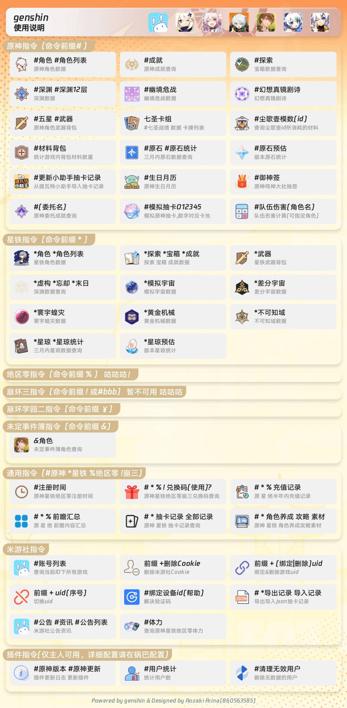
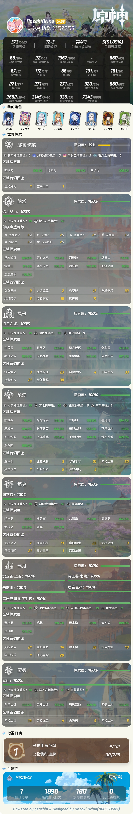
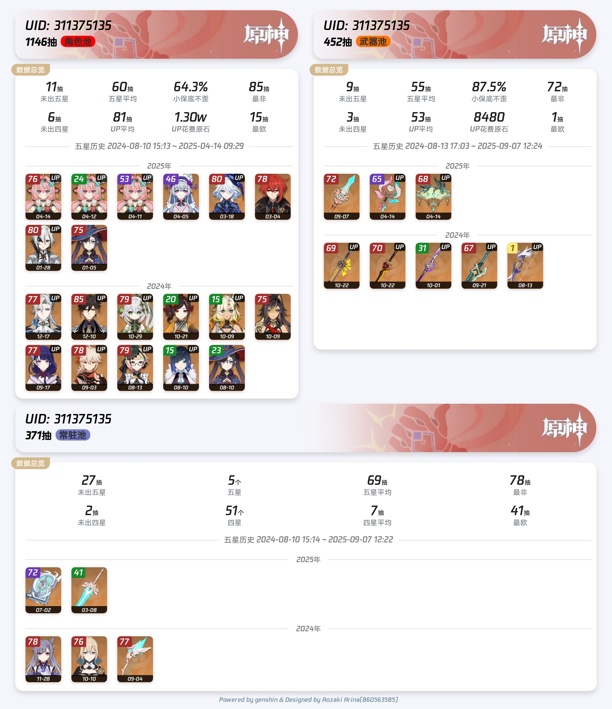
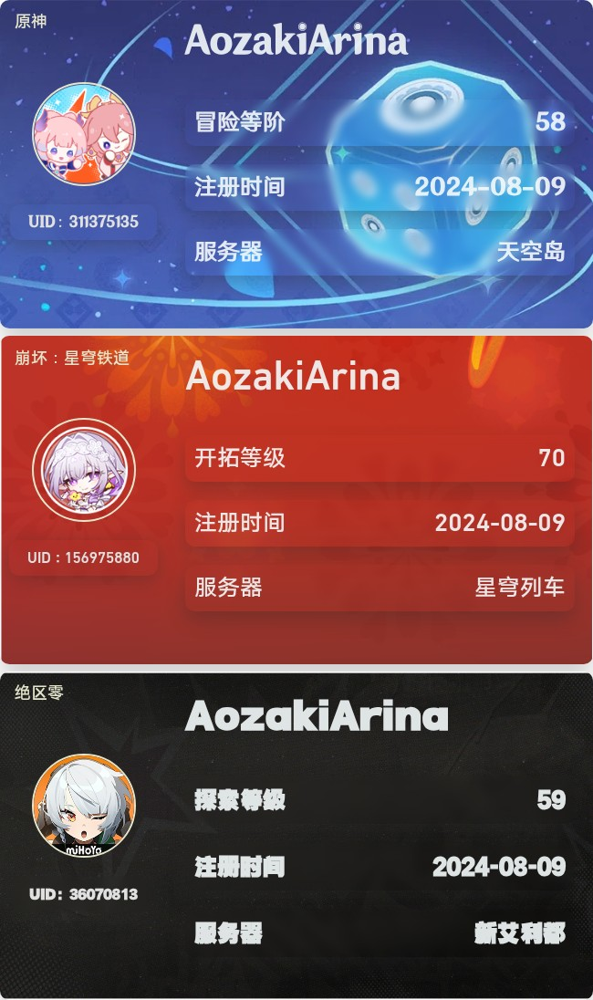
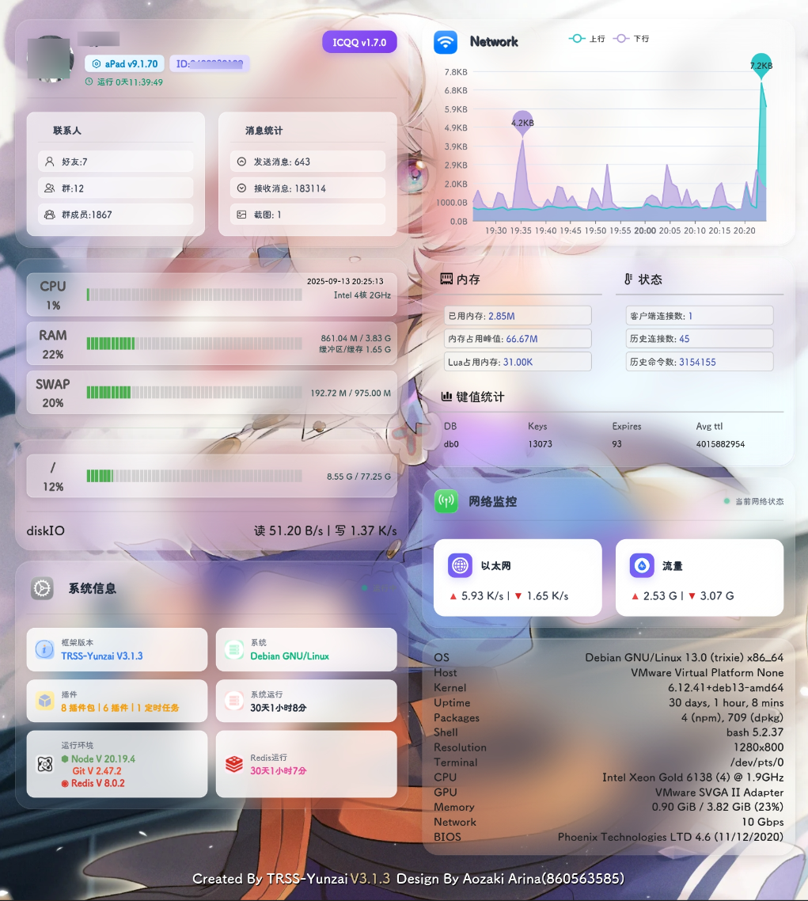

# TRSS-Yunzai 修改版

> 基于 TRSS-Yunzai 的个人修改版本，针对日常使用进行了多项优化和改进


## 🚀 快速开始

### 环境要求
- Node.js 16+ 
- Git

### 安装步骤

1. **克隆仓库**
   ```bash
   git clone --depth=1 https://github.com/AozakiArina-Bot/Yunzai.git
   cd Yunzai
   ```

2. **换源**
   ```bash
   git remote set-url origin https://github.com/AozakiArina-Bot/Yunzai.git
   git fetch origin master
   git reset --hard origin/master
   ```

4. **安装依赖**
   ```bash
   npm install
   # 或使用 pnpm
   pnpm install
   ```

## playwright渲染器

### 安装步骤

1. **安装 Playwright 依赖**
   ```bash
   # 使用 npm
   npm install playwright
   
   # 或使用 pnpm
   pnpm install playwright
   ```

2. **安装 Playwright 浏览器**
   ```bash
   # 安装 Chromium 浏览器（必需）
   npx playwright install chromium
   
   # 或安装所有浏览器（可选）
   npx playwright install
   ```

3. **配置渲染器**
   
   编辑 `config/config/renderer.yaml`，设置渲染器为 `playwright`：
   ```yaml
   # 渲染后端, 默认为 playwright
   name: playwright
   ```

### 系统要求

- **Windows**: 无需额外配置，直接安装即可
- **Linux**: 可能需要安装系统依赖
  ```bash
  # Ubuntu/Debian
  sudo apt-get install -y libnss3 libatk1.0-0 libatk-bridge2.0-0 libcups2 libdrm2 libxkbcommon0 libxcomposite1 libxdamage1 libxfixes3 libxrandr2 libgbm1 libasound2
  
  # CentOS/RHEL
  sudo yum install -y nss atk at-spi2-atk cups-libs libdrm libxkbcommon libXcomposite libXdamage libXfixes libXrandr mesa-libgbm alsa-lib
  ```
- **macOS**: 无需额外配置，直接安装即可

### 功能特性

- ✅ 支持高清晰度截图（可配置 `deviceScaleFactor`）
- ✅ 支持多页截图（`multiPage`）

### 注意事项

- 首次安装需要下载 Chromium 浏览器（约 300MB），请确保网络畅通
- 建议在 `config/config/bot.yaml` 中配置 `deviceScaleFactor` 来调整清晰度

## ✨ 主要优化内容

### 🔧 功能增强
- **违规记录查询** - 新增个人违规记录查询功能
- **图片优化** - 优化 404 和超时错误图片显示
- **状态可视化** - 状态和日志改为图片形式展示
- **playwright渲染器** - 使用 playwright 作为默认渲染器

### 🛠️ 系统优化
- **自动备份** - 新增自动备份和定时清理功能
- **日志管理** - 自动删除超过七天的日志文件
- **消息优化** - 全部更新改为合并消息显示
- **版本回退** - 支持直接使用 `#回退miao3` 回退喵喵三个版本

### 📦 依赖管理
- 保持与原版依赖兼容性
- 不会随意修改核心依赖版本

## 📞 联系方式

<div align="">

🐧 **QQ**: [860563585](https://res.abeim.cn/api/qq/?qq=860563585)

</div>

## 🎮 功能展示如以下有需要请看联系方式

### 原神仓库相关功能
| 功能 | 预览 |
|------|------|
| 修改内容 |  |
| 探索 |  |
| 模拟抽卡 |  |
| 抽卡记录 |  |
| 注册时间 |  |

### 状态监控


## ⚠️ 免责声明

- 本项目仅供学习和个人使用
- 请遵守相关法律法规和平台规则
- 使用过程中产生的任何问题，作者不承担责任

## 📄 许可证

本项目基于原版 TRSS-Yunzai 许可证，详见 [LICENSE](./LICENSE) 文件。
